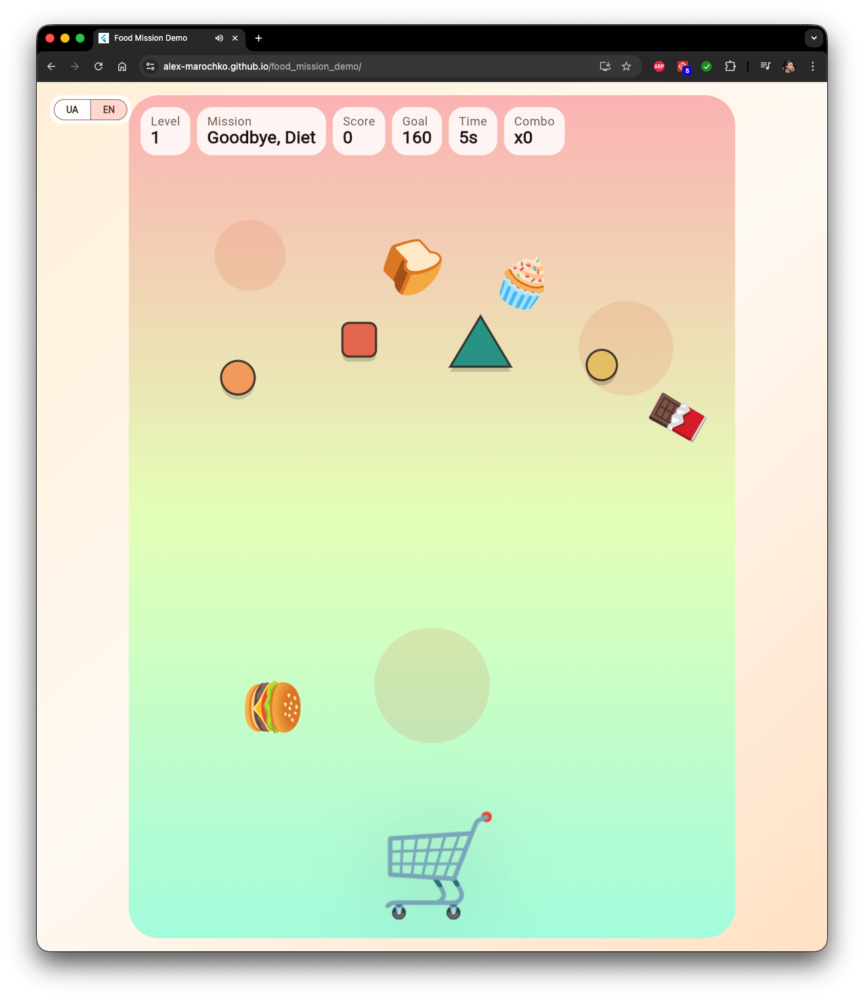

# Food Mission Demo

Flame-powered Flutter demo of a gamified e-com mini-game built around short food-emoji missions.

## Live Demo

- [alex-marochko.github.io/food_mission_demo/](https://alex-marochko.github.io/food_mission_demo/)



## What Is Implemented

- `90` sequential levels with deterministic planning
- rotating missions:
  - `Goodbye, Diet`
  - `Eat Properly`
  - `Vitamin Boost`
- `Flame` game board with:
  - accelerated falling food emoji
  - wall, obstacle, and food-to-food bounces
  - responsive scaling that preserves board aspect ratio
- popup-driven flow:
  - intro popup before every level
  - win popup with native Flutter score-transfer animation
  - lose popup
  - pause popup
- localized UI with runtime language switcher:
  - Ukrainian
  - English
- persisted locale selection via `shared_preferences`
- catch SFX:
  - correct catch
  - wrong catch
- bundled `Noto Color Emoji` font asset for web and explicit emoji rendering in the main emoji-heavy surfaces

## Stack

- `Flutter`
- `Flame`
- `flutter_bloc`
- `equatable`
- `shared_preferences`
- `flame_audio`

## Project Structure

- `lib/src/core`
  - audio
  - localization
  - theme
- `lib/src/features/food_mission/domain`
  - emoji catalog
  - mission definitions
  - deterministic level planner
- `lib/src/features/food_mission/application`
  - session state
  - scoring
  - level flow
- `lib/src/features/food_mission/presentation`
  - board orchestration screen
  - Flame scene
  - overlays
  - popups

## Gameplay Summary

- Level `1` starts at `20s`
- Every next level adds `+1s`
- Missions rotate in fixed order starting from `Goodbye, Diet`
- Spawn pacing follows repeating `20s` waves with a peak at second `13`
- Correct catch:
  - increases combo
  - awards combo-scaled points
- Wrong catch:
  - subtracts `10`
  - resets combo
- Goal reach activates `goal lock`
  - the round still plays until timer end
  - once locked, the level can no longer be lost

Full rules live in [docs/level_progression.md](docs/level_progression.md).

## Controls

- Mouse:
  - move the cart horizontally
- Keyboard:
  - `A / D`
  - `← / →`
- Pause:
  - `Esc`
  - automatic pause on app focus loss

## Run

```bash
flutter pub get
flutter run -d chrome
```

Desktop example:

```bash
flutter run -d macos
```

## Verify

```bash
flutter analyze
flutter test
flutter build web
```

## Publish

Recommended path for this demo:

1. Push the repository to a public GitHub repo
2. Open repository settings
3. In `Pages`, set source to `GitHub Actions`
4. Push to `main`
5. The workflow at `.github/workflows/deploy_pages.yml` will build and publish the web app

For a normal project repo the final URL will be:

```text
https://<github-username>.github.io/<repo-name>/
```

If the repository name itself ends with `.github.io`, the workflow automatically switches to root-path deployment.

## Assets

- Audio:
  - `assets/audio/catch_good.wav`
  - `assets/audio/catch_bad.wav`
- Emoji font:
  - `assets/fonts/NotoColorEmoji.ttf`
- Shader:
  - `shaders/reward_sweep.frag`

## Testing Coverage

- domain:
  - mission catalog
  - level planner
- application:
  - session cubit
  - locale cubit
- widget layer:
  - intro popup rendering
  - locale switch smoke flow

## Notes

- The demo includes debug popup preview buttons only in `kDebugMode`.
- `Noto Color Emoji` is bundled to improve emoji consistency on web, but final rendering may still vary by browser/renderer.
